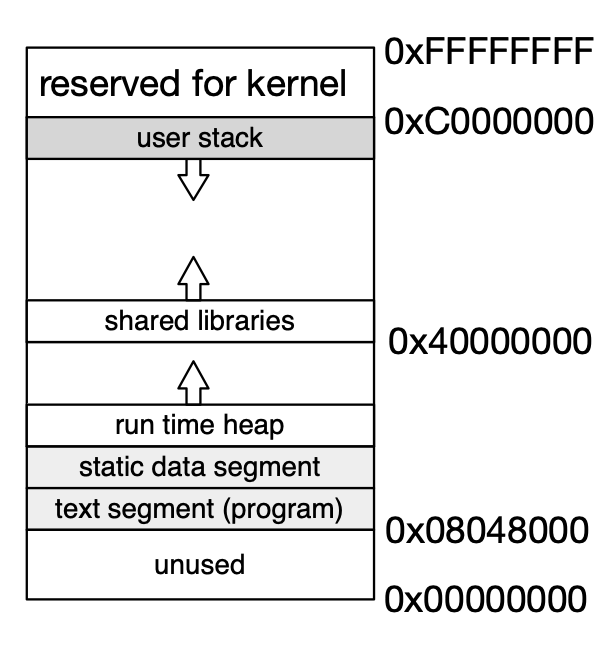
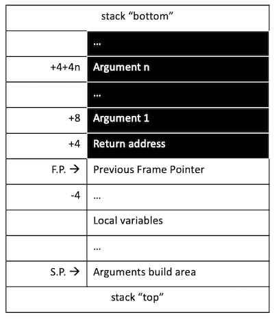
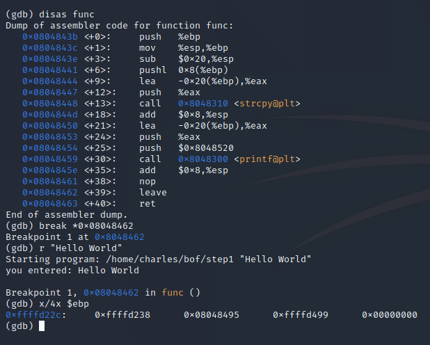
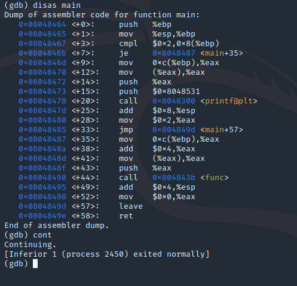
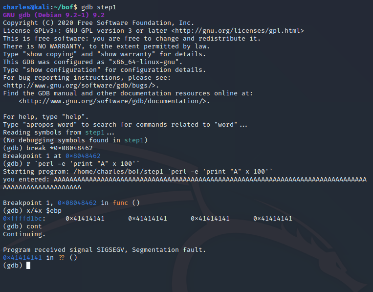

# Introduction

The Buffer-Overflow is perhaps one of the most famous system attacks. The aim of this tutorial is to give some background on what makes this attack possible, then explain the attack, and finally provide some source files and binary examples for you to experiment. 

The binaries in this repo are pre-compiled for a 32 bits Linux system and have been tested with 32 bits and 64 bits Virtual Box images of [Kali](https://www.kali.org). Please read the instructions with the binaries on how to setup your system. 

**WARNING:** The tutorial attacks are only possible when you weaken the default security settings of your system. Please do not try these attacks the system you normally use and reserve them for an experimental system (e.g., Virtual Box image). 

To clone the repository within a Linux environment: 

```bash
git clone https://gitlab.com/morisset/bof.git
```

This will create a folder `bob`, which we will use below. If you already all about virtual memory and gdb, please feel free to skip the Background section and to go straight to [Buffer Overflow](#BufferOverflow). 

# Background 

## Virtual Memory

We do not provide in this page a full explanation of how system memory works. However, some important concepts to keep in mind are: 

- Programs are loaded from the hard-drive to the memory to be executed. 
- The memory is organised as a Virtual Memory, with addresses expressed in hexadecimal. All addresses we consider here are virtual. 
- The virtual memory contains a range of data: instructions coming from the program, control-flow instructions, user data, etc. Although these different types of data are normally separated, the buffer overflow attack aims at breaking the boundaries. 

If you're familiar with this, you can skip directly to the next section. Otherwise, things will hopefully be clearer once we start playing with the actual code. Don't try to understand everything below, just try to focus on the security relevant bits. In many cases, attackers are capable of compromising a system without understanding it fully: they just need to understand how to break it! 

 For now, consider the C program below, which corresponds to the file `step1.c` in the folder `bob`. This is a very simple (and boring) piece of code:

- The function `main` takes one argument from the command line (remember that in C, the first argument is always the name of the program itself, so the actual argument is the second argument), call the function `func` with that argument. 
- The function `func` takes one argument, creates a buffer of 32 bytes, copies the argument in the buffer, and print the content of the buffer. 

```c
#include <stdio.h>
#include <string.h>
#include <unistd.h>

void func(char *s){
  char buf[32];
  strcpy(buf, s);
  
  printf("you entered: %s\n", buf);  
}

int main(int argc, char *argv[]){
        if(argc != 2){
                printf("Usage: %s some_string\n", argv[0]);
                return 2;
        }

        func(argv[1]);

        return 0;
}
```


If you run this program (you should be able to run the program directly, don't try to recompile it), you'll get: 

```bash
$ ./step1 "hello world"
you entered: hello world
```

So far, so good. Let's now look at the actual program. Use the command `objdump -d step1` (the `-d` option indicates that the code should be disassembled). You should a bunch of code, including the two sections below, which correspond to the assembly code of the function `func` and `main` respectively: 

```assembly
0804843b <func>:
 804843b:       55                      push   %ebp
 804843c:       89 e5                   mov    %esp,%ebp
 804843e:       83 ec 20                sub    $0x20,%esp
 8048441:       ff 75 08                pushl  0x8(%ebp)
 8048444:       8d 45 e0                lea    -0x20(%ebp),%eax
 8048447:       50                      push   %eax
 8048448:       e8 c3 fe ff ff          call   8048310 <strcpy@plt>
 804844d:       83 c4 08                add    $0x8,%esp
 8048450:       8d 45 e0                lea    -0x20(%ebp),%eax
 8048453:       50                      push   %eax
 8048454:       68 20 85 04 08          push   $0x8048520
 8048459:       e8 a2 fe ff ff          call   8048300 <printf@plt>
 804845e:       83 c4 08                add    $0x8,%esp
 8048461:       90                      nop
 8048462:       c9                      leave  
 8048463:       c3                      ret    

08048464 <main>:
 8048464:       55                      push   %ebp
 8048465:       89 e5                   mov    %esp,%ebp
 8048467:       83 7d 08 02             cmpl   $0x2,0x8(%ebp)
 804846b:       74 1a                   je     8048487 <main+0x23>
 804846d:       8b 45 0c                mov    0xc(%ebp),%eax
 8048470:       8b 00                   mov    (%eax),%eax
 8048472:       50                      push   %eax
 8048473:       68 31 85 04 08          push   $0x8048531
 8048478:       e8 83 fe ff ff          call   8048300 <printf@plt>
 804847d:       83 c4 08                add    $0x8,%esp
 8048480:       b8 02 00 00 00          mov    $0x2,%eax
 8048485:       eb 16                   jmp    804849d <main+0x39>
 8048487:       8b 45 0c                mov    0xc(%ebp),%eax
 804848a:       83 c0 04                add    $0x4,%eax
 804848d:       8b 00                   mov    (%eax),%eax
 804848f:       50                      push   %eax
 8048490:       e8 a6 ff ff ff          call   804843b <func>
 8048495:       83 c4 04                add    $0x4,%esp
 8048498:       b8 00 00 00 00          mov    $0x0,%eax
 804849d:       c9                      leave  
 804849e:       c3                      ret    
 804849f:       90                      nop

```

No need to understand everything, a lot is just core mechanics (and it's not very intuitive!). Basically, in the left column we have the address in the virtual memory, while in the right column, we have the assembly instructions. Let us ignore most of the instructions for the moment, and focus on the following instruction in `main`: 

```assembly
8048490:       e8 a6 ff ff ff          call   804843b <func>
```

Think about the way a program executes as having a pointer that just reads instruction, one after the other, starting from the initial one (in the same you would do for a cooking recipe). In the case above, the execution pointer reaches the address `8048490`, it will execute the instruction `call 804843b` (it's actually slightly more complicated than that, but this is a good level of abstraction), which moves the pointer to the address `804843b`, which happens to be the first address of the program corresponding to `func`. The pointer will therefore execute: 

```assembly
804843b:       55                      push   %ebp
```

followed by 

```assembly
804843c:       89 e5                   mov    %esp,%ebp
```

and so on and so forth. However, when the pointer reaches the last address in the `func` block  (`8048463`), how does it know where to return? If it just tries to execute the next address in virtual memory (`804864`), it would start the function `main` from the beginning, which is not what we want. Instead, we want to go back to the address `8048495`, which is the next address after executing the call to `func`. To keep with the cooking recipe analogy, if you are following a recipe for a lasagna and the recipe book tells you to go to another page for the white sauce recipe, you need to remember at which page is the lasagna recipe and at which stage you were once you're done with the white sauce. You could do that for instance by using a post-it or simply rely on your memory. 

It is the same for the computer, it relies on its memory and this is where the stack comes in. The figure below presents a very high level view of the virtual memory. Note that by convention, the lowest address is at the bottom. The program instructions are stored in the part of the memory starting at `0x08048000`, which is why the addresses of functions `main` and `func` above are close to `0x08048000`.  



The stack itself is located in a different part of the memory, and is organised in stack frames. A stack frame is allocated for each function call and contains the function arguments, the local variables, and the information needed to restore the caller’s state. The **frame pointer** and the **stack pointer** delimit a stack frame. Most information is accessed relative to the frame pointer, as described in the picture below. We can see that just after F.P. (the frame pointer), we have the return address, i.e., the address to which we want to return after this function is finished. 



So when we call `func`, the system will create a new stack frame, store the previous frame pointer at the address pointed by the Frame Pointer (F.P.). Let's look at an example below. 

## Using GDB

Let us have a look with the program `step1`. To do this, we use `gdb`, which allows us to debug a program. In the `bof` folder, type: 

```
$gdb step1
```

In gdb, we are going to use four commands: 

* `disas` disassembles a function and shows the code, similar to `objdump -d` 

* `breakpoint` introduces a breakpoint in the execution of the program at a specific address

* `r` run the program (possibly with arguments)

* `x/4x $ebp` display the 4 memory words  starting at the Frame Pointer (which is contained in the register `$ebp`). 


For instance, you can look at the code of the function `func` by typing `disas func` once you are in `gdb`. Let us ignore most the code for now and let us just look at the last two instructions: `leave` is the instruction indicating that we are going to leave the current stack frame and `ret` is the instruction indicating the execution should return to previous frame. How do we know where to return? We can see in the table above the return address is stored in the current stack frame, just above the Frame Pointer. 



In the image above, we set a breakpoint just before the instruction `leave` (which is done with the command `break *0x08048462`) and we run the programme with the argument "Hello World" (which is done with the command `r "Hello World"`). When the execution stops, the memory is still in the stack frame of the execution for the function `func`. We can inspect the 4 words starting from the Frame Pointer (which is done with the command  `x/4x $ebp`) and see: `0xffffd238` (which is the value of the previous frame pointer), followed by `0x08048695` (which is the return address), followed by `0xffffd499` and `0x00000000` (let us ignore those two). If you don't see that, make sure you have correctly set up the breakpoint and run the program. 

What does the return address `0x08048695` correspond to? If you disassemble the function `main`, you can see it corresponds the address immediately after the call to the function `func`: 



We can finish the execution of the program with the command `cont`, and the process exits normally, which means all went well. Let us try to break things up now! 

# Buffer Overflow

In the previous example, the execution knows where to return to because the return address is stored in memory. However, we can see that it is stored very closed to other bits of data, including data that are local variables and can therefore be modified by the user. This is one of the main vulnerabilities enabling the Buffer Overflow attack: the mix of control flow data (critical) and user input data (not necessarily trusted).

If you look again at the code of the program `step1`, you can see that the function has a local buffer `buf` of size 32 characters.  

```C
void func(char *s){
  char buf[32];
  strcpy(buf, s);
  
  printf("you entered: %s\n", buf);  
}
```

This means that in the stack frame of the function `func`,  in the part of the memory corresponding to the local variables, 32 characters of memory will be allocated for `buf`, and the content of the string passed as an argument of `func` will be copied in this memory space. It might not be adjacent to the Frame Pointer, but it won't be far. You can inspect the memory "below" the Frame Pointer in `gdb` by using `x/-16x` (assuming you still have the breakpoint and run the programme from the start). Try to see if you can locate the string "Hello World" in memory! (You might need to look at ASCII encoding ...)

What happens if you try to put more than 32 characters in `buf`?  If you are using a modern programming language, such as Java, the memory for a String will be allocated at run-time, which means that Java will automatically allocate in memory the size needed. However, C is a bit more ancient, and even though it's possible to use dynamic allocation, the example above use static allocation. 

Let us try to put a very large number of characters, say, 100 "A" in `buf`. Because we don't really want to have to type manually 100 "A", we can use a simple perl script: `perl -e 'print "A" x 100'` prints 100 "A". Be very careful of the quotes, the syntax is very specific! 

We can now run the debugger from the start (note that in order to use the perl script as an argument for `r`, we need to use back-ticks. Yes, we use three types of quotes in  ``r `perl -e 'print "A" x 100'` ``. )



We can see that when we inspect the memory at `$ebp`, all memory seems to be filled with the value `41`, which is the ASCII code for "A"! In other words, the program started copying the symbol "A" from the local variable part of the stack frame and kept copying above, erasing the Frame Pointer, the return address and even the arguments of the function. As a result, when the execution leaves the function `func`, it tries to go to the address `0x41414141`, which is not allowed (there is no program to be executed) and leads to a segmentation fault (which means that the execution tries to go into the wrong segment of the memory). 

Congratulations, you just did your first Buffer Overflow attack! 

## Control Flow Redirection

The attack above leads to crashing the programme `step1` by causing a segmentation fault. Crashing a program can be used if an attacker tries to limit the availability of a system, but it is usually quite limited otherwise. However, what if, instead of redirecting the execution to the arbitrary address  `0x41414141`, we could instead redirect it to a memory address we could exploit? 

Let us look at the next file in the repository: `step2.c`

```C
#include <stdio.h>
#include <string.h>
#include <unistd.h>

int func(char *s){
  char buf[32];
  strcpy(buf, s);
  
  printf("you entered: %s\n", buf);
  if(strcmp(buf, "secret")) { 
    return 0;
  }
  return 1;  
}

int main(int argc, char *argv[]){
        if(argc != 2){
                printf("Usage: %s some_string\n", argv[0]);
                return 2;
        }
        int res = func(argv[1]);

        if (! res) {
          printf("you are denied\n");
          return 0;
        }

        printf("you are allowed\n");
        return 0;
}
```

The overall structure is very close to that of `step1.c`, with a function `main` calling a function `func`. The main difference is that `func` is now doing something more useful: it compares the input to the string `secret`, and 0 if it's the same, 1 otherwise. If `func` returns 0, `main` will either print "you are allowed", and will print "you are denied" otherwise. In practice, you could imagine `main` doing something more critical, like copying files. If you try to execute this program, you'll get this: 

```bash
~/bof$ ./step2 notsecret
you entered: notsecret
you are denied

~/bof$ ./step2 secret
you entered: secret
you are allowed
```

Can we exploit the Buffer Overflow so that we input a string different from "secret", and yet get the programme to print "you are allowed"? Yes! 

To realise this attack, you need to 

